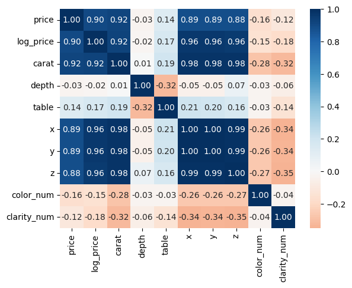
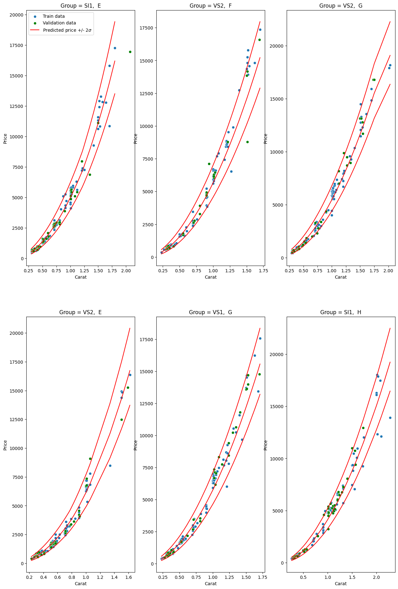

# Solutions
The present document contains a brief, non-technical discussion of the most salient aspects of the solutions to the **Regression task for the Diamonds dataset**. It also includes a description of the main files and how to run the code. 

Don Francesco should probably read this document, while his data scientist Luca should also take a look at the code in the notebooks and the scripts.

## Challenge 1
**What makes z diamond valuable?** This challenge is discussed at length in the [Challenge1](./challenge1.ipynb) notebook. Most of the code is contained in the notebook, except for a couple of functions in [helpers.py](./helpers.py). 

### Exploratory Analysis
We begin by importing and cleaning the data, followed by an exploratory analysis to identify the most important features. The observation is that the *price* varies among 2 orders of magnitude,  *carat* (the weight of a diamonds) varies by about 1 order of magnitude, while the other numerical quantities vary much less. This leads us to introduce the quantities *log_carat* and *log_price*

We can then inspect the correlation among the variables: 



We find that *price* is strongly correlated with *carat* and with the linear dimensions (*x, y, x*). The linear dimensions are also highly correlated with each other and with the *carat*. TThis suggests the presence of multicollinearity, which means in layman's terms that many variables provide essentially the same information. This makes sense if the diamonds do not have a preferred dimension and the specific weight of the diamonds is approximately constant. In the [Challenge1](./challenge1.ipynb) notebook we checked the validity of this hypothesis.

The bottom line is that the most important variables for determining the price of a diamond are the *carat*, the *color* and the *clarity*. In the following plot we inspect visually these quantities:


From this plot, it is cle_ar that there is a linear relationship between *log_carat* and *log_price*. Additionally, fairer colors (in purple) are associated with higher prices, as are clearer diamonds (with clarity levels ordered in increasing clarity from top to bottom in the legend).

This plot is what most motivated the choice of linear models to answer the question **"What makes a diamond valuable?"**. Linear models are simple, interpretable, and seem to be applicable to the present dataset.

***
### Linear models


In the [Challenge1](./challenge1.ipynb) notebook, we tried different *linear* and *log-linear* models, but here we present only the latter for brevity. We used a set of log-linear models employing the most correlated features to predict price first, and then the least correlated ones. SSince we are simply interested in explaining the data, we did not separate the data into train and test sets. 
In the plot below, different metrics are shown for a set of log-linear models, which are ordered on the x-axis by increasing complexity.


"carat," "color," and "clarity" appear to be the most predictors. The metrics improve significantly with the introduction of these variables and then remain roughly constant. We therefore settle for the most parsimonious and best model:

$$ price = \alpha_0 \cdot (carat)^{\alpha_1} \times (color) \times (clarity)$$

We can thus state that **The most important factors for determining the price of a diamond are: the carat, the color and the clarity.**

We can finally assess the fit of the model by analyzing the residuals. We find that the residuals have a zero mean, are distributed with a bell-shaped curve (but are not gaussian, as they present fatter tails) and are not strongly correlated with any of the predictors, nor the price (see the plot below).


## Challenge 2
For this challenge, we are tasked with designing a model that can predict the price of a diamond in a reliable and interpretable way. We first import and clean the data. Being a predictive task, we divide the data into a training set (used to train the model), a validation set (to select the best model), and a test set to assess how well the selected model generalizes to unseen data.


Given the importance of interpretability, we naturally gravitate towards linear and log-linear models. Since we also aim to improve the performance of the model as much as possible without compromising interpretability and with a bias towards simplicity, we analyze a greater number of candidates, including interaction terms between variables. We assess their performance on the training and validation sets. Below, you can find a plot showing the metrics for log-linear models of increasing complexity along the x-axis.

[]

The performance of the models improves on the training set as more complex models are employed. However, on the validation set, their performance improves only initially, while it tends to deteriorate with larger models, which is an example of overfitting. We find that the following model achieves good performance on the training and test sets without compromising interpretability (see the notebook for additional details):

$$price = const \times mul(col, clar)\times (carat) ^\alpha (depth )^\beta( table)^\gamma$$

The parameters fitted are:
1. $const = 46339$
2. $\alpha = 1.89$
3. $\beta = -0.27$
4. $\gamma =-0.36$
5. $mul(col, clar)$ is a multiplier specific to the color and clarity level of each diamond. The multipliers are presented in the following table:

]

### Neural Network Error model

It would be tempting to use neural networks for this task. Neural networks are a class of very powerful machine learning models but are hard to interpret. Don Francesco would probably not like them ...

In the [Challenge2](./Challenge2.ipynb) notebook, we employed them anyway and found comparable performance to the model presented before (and also similar predictions).

Nonetheless, we finally used the flexibility of neural networks in a way that Don Francesco would probably appreciate. Since he is probably interested in trading the diamonds, having a confidence level of the price of the model would probably be useful for him. 

Becaus of this we hypothesized the following model noise model:

$$y = f_\theta(x) + \sigma_\theta(x) \epsilon$$

And trained a neural network to jointly learn $f_\theta(x)$ and $\sigma_\theta(x)$.

You can find below the prediction of the mean price and the standard deviation for several points in the training and validation sets, for a collection of 6 color-clarity groups: 



### Results on the test set
We can finally look at the perfomance of our models on the test set. A key metric is the relative error of the price prediction. How much can Don Francesco expect to be wrong when he blindly relies on our log-linear model?

From the plot below we can see that in 57% of the times he can expect to make an error of 10% of the price or smaller. 87% of the times he will make an error of less than 10 % of the price, while in only 1% of the times he will make an error greater than 40% of the price.

]

Furthermore, Don Francesco can use the Error model to have a confidence level of the predictions. We find that, on the test set: 
1. 71% of the predictions lie within 1 std 
2. 96% of the predictions lie within 2 std 
3. 99% of the predictions lie within 3 std 

## Data Pipeline
The implementation of the data pipeline is in the [pipeline.py](./pipeline.py) file. The file [pipieline_main.py](./pipeline_main.py) exemplifies the use of the pipeline. When initialized, the pipeline takes several arguments, like the path to the current data folder (which should contain a 'train.csv' and a 'test.csv' file) and the path to the new data folder (which should contain the 'new_data.csv' file). At initialization the pipeline should also be provided with a list of models that we want to train/deploy. 

### Functionalities

The pipeline can: 
1. Fetch the new data from the new data folder with the **pipeline.fetch_new_data()** function.
2. Clean the data using different imputation techniques, with the **pipeline.clean_new_data()** function.
3. Add the new and cleaned data (along with the current date) to the main train and test data with the **pipeline.save_new_data()** function.
4. Train the models with the **pipeline.train()** function.
5.  After training, the pipeline also saves the models along with a log file (models_log.json) which contains the history of all trained models, training date, and performance measured according to the list of metrics specified for each model. This is done with the **pipeline.save_models()** function.
6. The pipeline can also be used to select the best model according to a criterion specified by the argumnet model_selection_criterion. This is done with the **pipeline.select_model()** function and the **pipeline.swap_models()** function. The pipeline compares the models saved in log_models.json and imports the best model.
7. Finally, the pipeline can be used to make predictions with the **pipeline.predict()** function.

### How to run

To use the pipeline, the script [initialize_pipeline_data.py](./initialize_pipeline_data.py) should be run first. This initialized the folder and splits the data contained in the original diamonds dataset to simulate the creation of new data. Then the script [pipeline_main.py](./pipeline_main.py) can be run. This will update the data and the models saved the folder pipeline/data_models.

The pipeline uses the scripts [models.py](./models.py) and [metrics.py](./metrics.py)

1. [models.py](./models.py) contains the LogLinearModel and NNModel classes, which are wrappers around the loglinear and neural network models introduced in the [Challenge2](./Challenge1.ipynb) notebook. These wrappers extend a BaseModel class, and are designed to be used with the pipeline.

2. [metrics.py](./metrics.py) contains a Metrics class and is designed to run a subset of the metrics that are implemented within the class itself. Each model in [models.py](./models.py) can run a subset of metrics using the Metrics class.

## ML API

### Functionalities
The code to define the API is contained in the [ml_api.py](./ml_api.py) file. The API is implemented using fastapi. The API is designed to be used with the pipeline. When tha [ml_api.py](./ml_api.py) file is run, a pipeline is automatically initialized, and the pipeline functions can be accessed via the API endpoints.

1. The **./retrain** endpoint retrains the models using the new data provided
2. The **./select** endpoint imports the best model among the ones available and listed in the models_log.json file. After a call to this endpoint the *./retrain* endpoint cannot be called again
3. The **./predict** endpoint makes predictions using the selected model. It should also be provided the data to make predictions
4. The **available_models** endpoint returns a list of available models from the models_log.json file

### How to run 
To run the API, the [initialize_pipeline_data.py](./initialize_pipeline_data.py) should be run first. To use the **./select** endpoint, the file models_log.json should be created first which is achieved by either running [pipeline_main.py](./pipeline_main.py) or by training a model using the api. 

The ml pipeline can be run using uvicorn

```bash
uvicorn ml_api:app --reload --port 8000
```
The use of the ml api is exemplified in the [ml_api_test.py](./ml_api_test.py). Once the api is running, the user can make run this script:
```bash
python ml_api_test.py
```

## Additional: simple html UI

A simple ui is implemented using the files [templates/index.html](./templates/index.html) and [static/style.css](./static/style.css). It can be run using the command line:

```bash
uvicorn web_app:app --reload --port 8001
```

Before running the app we should run the [initialize_pipeline_data.py](./initialize_pipeline_data.py) create a models_log.json file using the [pipeline_main.py](./pipeline_main.py) or the [ml_api.py](ml_api.py). 
The ui can: 
1. Access the data in the diamonds dataset
2. Add new data
3. Retrain new model using the ml api
4. Select the models and predict on new data using the ml_api

**Wehn inserting new data, you should respect the format of the data and insert valid colors/clarity/cut names**

Here's what you should see when you first run the web_api: 

